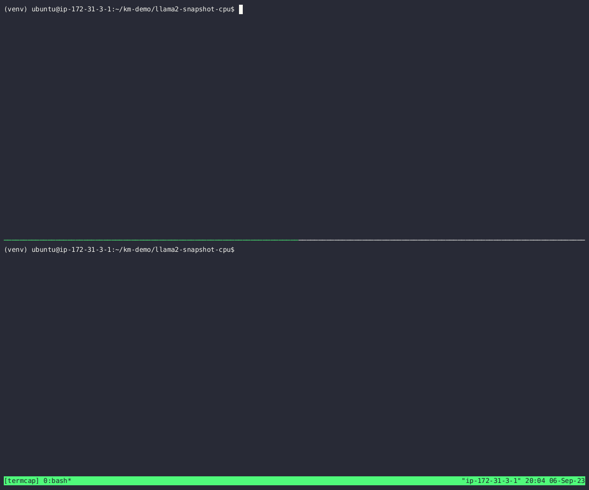
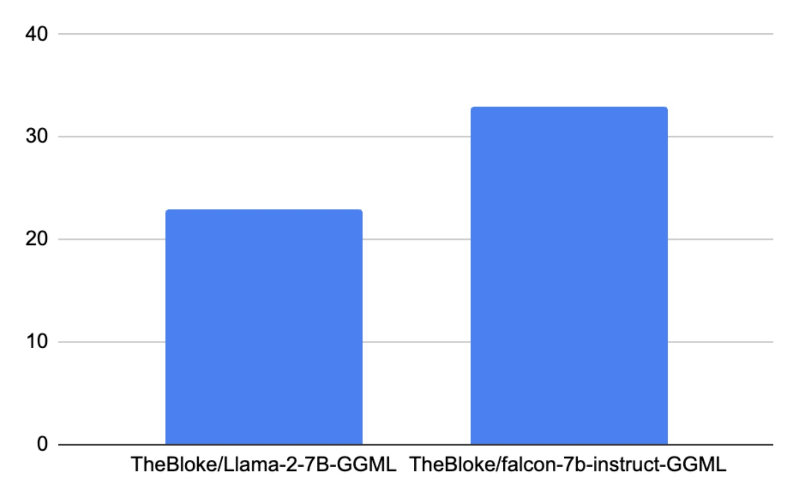

# Instant startup of LLama2/Transformer model service with Kontain Monitor
### Starting LLM service without a snapshot


### Starting or Scaling LLM service on a "cold start" instantly with snapshot


## Introduction
The growing demand for AI Language Model (LLM) Services faces challenges due to the scarcity and high costs of GPUs. To address this, the open-source community is exploring CPUs and Commodity Hardware as a cost-effective alternative, leading to innovative projects.

Serverless computing, coupled with established scaling techniques, enhances LLM service scalability. Key serverless terms, "Scale to Zero" and "Scale from", dynamically manage capacity based on demand.

The GGML tensor library, used in projects like llama.cpp, empowers AI workloads on CPUs.  GGML is used to enable large models and high performance on commodity hardware and is utilized by software such as llama.cpp and whisper.cpp, and enabling users on commodity hardware to run highly capable LLM models like llama2 and falcon.

Starting large LLM/Transformer models can take a lot of time [in order of x time/seconds/minutes](https://discuss.huggingface.co/t/why-the-model-loading-of-llama2-is-so-slow/47927), and this issue hinders being able to scale out seamlessly and for using serverless workloads to alleviate Inference serving.

Kontain Monitor solves “cold start” issues, enabling instant scalability/scale from zero for Transformer/LLM CPU workloads, utilizing readily available CPU resources for diverse services. We'll demonstrate this below.

## Inference service with Llama2 GGML model
To show how to use Kontain Monitor to avoid “Cold start” issues with your LLM or Transformer models, we will use an example that leverages the CTransformers library.  [CTransformers](https://github.com/marella/ctransformers) is a Python library that provides Python bindings for transformer models implemented in C/C++ using the [GGML](https://github.com/ggerganov/ggml) library.

It is designed to provide a unified interface for all models and supports a variety of transformer models, including Falcon, GPT-2, GPT-J, GPT-NeoX, LLaMa, MPT, Dolly V2, and StarCoder.

For more information on how to use CTransformers with LangChain, you can refer to the LangChain documentation.

Below we show a simple Flask application that enables inferencing using the [“TheBloke/Llama-2-7B-GGML”](https://huggingface.co/TheBloke/Llama-2-7B-GGML) model.  We assume that the model is available on a locally available disk cache.

As can be seen, this lends itself quite nicely to being used in a “functions as a service” platform that can scale up and down based on demand.

```python
from flask import Flask, request
from ctransformers import AutoModelForCausalLM
import sys, os
import time
import json

# create the Flask app
app = Flask(__name__)

start = time.time()
model_id = "TheBloke/Llama-2-7B-GGML"
llm = AutoModelForCausalLM.from_pretrained(model_id)
end = time.time()

print(f"time to load model {model_id}: {end-start}")

@app.route('/predict')
def query_example():
  prompt = request.args.get('prompt')
  result = llm(prompt)
  return json.dumps({"result": result})

if __name__ == '__main__':
    # run app on port 8080
    app.run(host="0.0.0.0", port=8080)
```

To install the requirements for this application, we can use a virtual environment:

```bash
python3 -m venv venv
source ./venv/bin/activate
(venv) pip install -r requirements.txt
```

where requirements.txt is:

```bash
# in terminal 1
(venv) ./venv/bin/python3 app.py
```

The following snippet shows the output of starting the service:

```bash
time to load model TheBloke/Llama-2-7B-GGML: 23.037739276885986
 * Serving Flask app 'app'
 * Running on all addresses (0.0.0.0)
 * Running on http://127.0.0.1:8080
 * Running on http://172.31.10.140:8080
```

To get an inference from the above service we can do the following:

```bash
# in terminal 2
curl -s -v http://localhost:8080/infer?prompt=SpaceX
{"result": " {"result": "\u2019s Starlink satellites have begun providing high-speed...
```

As can be seen, it took about 23.8 seconds to load the model the first time from a “cold” start.

If you repeat the same exercise with the Falcon LLM (GGML version) it takes about 33 seconds on a “cold” start.

When “Scaling up” (adding newer instances of the service) the cluster in say Kubernetes or other “Functions as a service” orchestration systems, this can add up and really make a difference.

Below we show some loading times for models using CTransformers.  Please note that the loading time for models in CTransformers is faster than maybe noted due to the conversion to GGML optimized format.




## Using Kontain Monitor to “Instantly” start the model service
[Kontain Monitor](https://github.com/kontainapp/km) can be used to start these models almost “instantly” even on cold starts.  Below we show an example of how to do this.

```bash
# in terminal 1
# activate the virtual environment
source ./venv/bin/activate

# Now, lets launch the same python application with kontain monitor
(venv) /opt/kontain/bin/km --mgtpipe=/tmp/km ./venv/bin/python3 app.py
time to load model TheBloke/Llama-2-7B-GGML: 23.037739276885986
 * Serving Flask app 'app'
 * Running on all addresses (0.0.0.0)
 * Running on http://127.0.0.1:8080
 * Running on http://172.31.10.140:8080
```

Then, once the service is “ready” to receive traffic, we take a Kontainer-ized “Snapshot” of the service as shown below:

```bash
# in terminal 2
/opt/kontain/bin/km_cli -s /tmp/mgtpipe

# the flask service will "dump" a snapshot of running process and exit
ls -l kmsnap
-rw------- 1 ubuntu ubuntu ... Aug 30 19:45 kmsnap
```

By using the management pipe, this sends a signal to the running flask program to create a snapshot of the running program.  This causes the service to exit after dumping a Kontain-erized “Snapshot” of the service having been written to disk as “kmsnap” as shown below.

The Kontain-erized “Snapshot” of a program is the running state of the process that has been captured on disk. It subsequently can be “restored” so that the program can “instantly” start.

“Instantly” start of the flask LLM Service using Kontain Snapshot

```bash
# in terminal 1

# "cold" start of the snapshot of the flask program
/opt/kontain/bin/km ./kmsnap

# it is available for inference "instantly" in this terminal thus avoiding the 23 or 33 second startup cost
```

```bash
# in terminal 2
curl -s -v http://localhost:8080/infer?prompt=SpaceX
...
{"result": " {"result": "\u2019s Starlink satellites have ...
```

## Summary
This shows that Kontain can effectively load the model almost “instantly”, that takes 23 seconds to load on a “cold” start.  This ensures that if the inferencing service needs to scale out, it can do so instantly and be available for inferencing requests almost “instantly” even on cold starts.

This effectively ensures that your inferencing services can be readily horizontally scalable and available on CPU resources and be able to “Scale from zero”.
