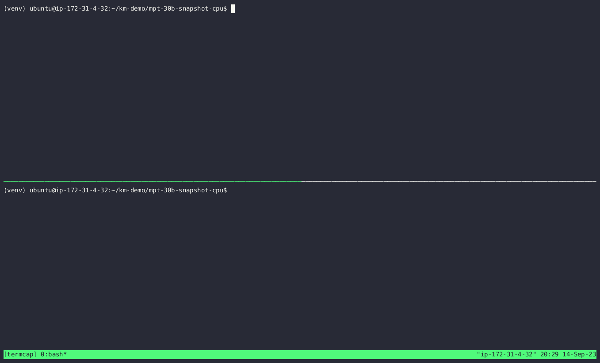
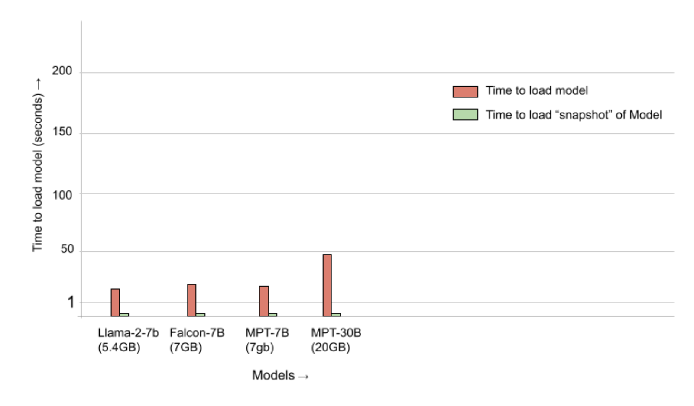

* [Introduction](#accelerating-inferencing-services-with-kontain)
  * [Unique Challenges](#unique-challenges-for-inferencing-services)
* [Use-case](#use-case-example)
  * [Demo: Starting mosaicml/mpt-30b LLM Service without snapshot](#demo-starting-llm-inference-service-mosaicmlmpt-30b-chat-without-a-snapshot)
  * [Demo: Starting mosaicml/mpt-30b LLM Service with snapshot](#demo-starting-llm-inference-service-mosaicmlmpt-30b-chat-from-a-cold-start-instantly)
  * [Description of example](#description-of-example)
  * [Load times of other LLMs](#load-times-of-different-llms)
  * [Inference Service using mosaicml/mpt-30b LLM](#inference-service-using-the-mosaicml-mpt-30b-model)
  * [Using Kontain Monitor to “Instantly” start the LLM Service](#using-kontain-monitor-to-instantly-start-the-llm-service)
    * [Capturing the LLM Service Snapshot](#capturing-the-llm-service-snapshot)
    * [“Instant” start of the flask LLM Service using the Kontain Snapshot](#instant-start-of-the-flask-llm-service-using-the-kontain-snapshot)
* [Summary](#summary)

# Accelerating Inferencing Services with Kontain

Inferencing—the thing you do with your AI model after it is developed, trained, tested, and ready to deploy to do useful work—is where almost all the money in AI will be made and is certainly where the bulk of the cost of AI will be expended.  The performance, scalability, cost effectiveness, and carbon footprint of inferencing are top of mind issues in the AI industry.

Hundreds of companies—including for example AWS, Hugging Face, and Cohere—provide services whereby users can invoke AI models to do inferencing work.  We’ll call these Inferencing Services, and we’ll call each running instance of a model an Inferencing Instance.

Demand for Inferencing Services is growing explosively.  This article describes a set of intense real-world problems in delivering Inferencing Services and demonstrates a solution.

## Unique Challenges for Inferencing Services

Delivering an Inferencing Service presents three particularly difficult challenges:

1. Response time:  Inference Services must deliver consistently quick response latency.  Unfortunately, the time to load an Inferencing Instance onto hardware, then warm up the needed software layers to make the model ready to serve, is generally tens of seconds and sometimes minutes.  This makes it impossible to deliver adequate response latency without having the Inferencing Instance running and pre-warmed before it is called.
2. Wasted resources:  Organizations running Inference Services complain of extremely low utilization.  A set of hardware resources (CPU, memory, GPU, etc) upon which an Inferencing Instance can be instantiated can be said to be in one of three states:  (i) Fulfilling an inference request, (ii) ready to fulfill an inference request but with no active request to serve, and (iii) getting ready to fulfill an inference request.  Only the first of these states is desirable for both the provider of the Inference Service and its consumers.  The second state is fine for the consumers, but extremely wasteful for the Inferencing Service provider; money is being burned while no useful work is being done.  The third state is where the consumer is angrily waiting for a response and the service provider is rushing to get ready, a state during which neither party is happy.

More than 90% of total hardware cycles, and the electricity burned, can be wasted.  The result: most commercial Inferencing Services generate less revenue than it costs to deliver the service.

3. Limited hardware availability:  There is a severe shortage of GPUs that is forecast to continue for the foreseeable future.  The explosive demand for AI computation, combined with the shortage of hardware, have accentuated the premium on solving inefficiencies.

In an ideal world, an Inferencing Service would spend very little time in states (ii) and (iii) described above.  The fundamental obstacle to achieving this is the extensive time it takes to load and warm a model to be ready to serve inferences.  The closer that time can be brought to zero:

1. The lower the cold start latency (state iii) experienced by Inferencing Service consumers.
2. The utility of having Inferencing Instances prewarmed but idle (state ii) approaches zero.
3. The smaller the amount of hardware that must be provisioned (and paid for) to serve consumers’ inferencing requests.

If the time to start large, complex models was close to zero, consumers would be very happy with the consistently excellent performance they realize.  They would also love the lower cost per inference that would naturally flow from the improved efficiency.

The Inferencing Service provider would be even more happy, because they could:

1. Serve more inferences (i.e. generate more value) on a given set of provisioned hardware.
2. Provision less hardware to deliver a given number of inferences.  This is like getting free hardware.  Given the shortage of very expensive GPUs, this is especially appealing.
3. Deliver consistently fast inferences, which attracts more customers.
4. Serve more customers, rather than putting them on wait lists.
5. Reduce the cost of generating an inference to below the amount consumers can be charged.  This is known as “making a profit”.
6. Pass some of their savings to customers in the form of lower price per inference.
7. Economically offer free or very low cost Inferencing Services to targeted market segments.
8. Take advantage of spot pricing for cloud hardware.

Kontain makes it possible to reduce the time to instantiate an Inferencing Instance enough to achieve these benefits, as shown below.

NOTE: The example below demonstrates Kontain accelerating an LLM (Mosaicml's mpt-30b) instance that runs on an x86 CPU using an AWS optimized “i4i.8xlarge” EC2 instance with 32vCPUs and 256GB of RAM.  All the software needed to run this example is available in [Kontain’s public GitHub](https://github.com/kontainapp/km) and this [example is here](https://github.com/kontainapp/km-demo/tree/master/mpt-30b-snapshot-cpu), so you can run your own experiments.  Software that performs the same function on NVIDIA GPUs is also available from Kontain, but has not been released publicly.  Please contact us at [kontain.ai](https://kontain.ai) to speak with us.

In addition to MosaicML's MPT, we have also provided additional examples for the [Llamav2](https://github.com/kontainapp/km-demo/tree/master/llama2-snapshot-cpu), [Falcon](https://github.com/kontainapp/km-demo/tree/master/falcon-snapshot-cpu), MosaicML’s MPT ([7B](https://github.com/kontainapp/km-demo/tree/master/falcon-snapshot-cpu) and [30B](https://github.com/kontainapp/km-demo/tree/master/mpt-30b-snapshot-cpu)) and Databricks [Dolly v2](https://github.com/kontainapp/km-demo/tree/master/dolly-v2-snapshot-cpu) LLM (models) here.

# Use Case example

## Demo: Starting LLM Inference Service (mosaicml/mpt-30b-chat) without a snapshot



## Demo: Starting LLM Inference Service (mosaicml/mpt-30b-chat) from a "cold start" "instantly"


## Description of example

To address the shortage of GPU hardware and to better leverage the relatively unlimited CPU capacity for LLM workloads, the GGML tensor library, used in projects like llama.cpp/CTransformers etc., empowers AI workloads on CPUs.  GGML is used to enable large models and high performance on commodity hardware and is utilized by software such as llama.cpp and whisper.cpp, and enabling users on commodity hardware to run highly capable LLM models like llama2 and falcon.

Starting large LLM/Transformer models can take a lot of time [(in order of 10s of seconds/minutes)](https://discuss.huggingface.co/t/why-the-model-loading-of-llama2-is-so-slow/47927), and this issue hinders being able to scale out seamlessly and for using serverless workloads to alleviate Inference serving.

Below are some examples of the time from a cold start to serve an inference request with and without Kontain.

Please note that a cold start means the time it takes to instantiate the service that loads the model from either disk or shared storage into memory - this would be the case when creating a new instance/replica of the service on a worker node.

Below we show some examples of the load time of some of the most popular LLMs of different sizes, and the load time of the same LLM’s Kontain-erized snapshot.

Inference Service endpoints managed by Kontain can near-instantly start processing requests even when there are no pre-warmed instances running.

## Load times of different LLMs


| Model name(Model Name/Source)                                                                   | Model size (GB) | Model Load Time (seconds) | Model Load Time using Kontain Snapshot(ms) |
| ------------------------------------------------------------------------------------------------- | ----------------- | --------------------------- | -------------------------------------------- |
| **[Llama-2-7B-GGML/TheBloke](https://huggingface.co/TheBloke/Llama-2-7B-GGML)**                 | 5.4             | 10.4                      | 200 ms                                     |
| **[falcon-7b-instruct-GGML/TheBloke](https://huggingface.co/TheBloke/falcon-7b-instruct-GGML)** | 7.6             | 13.66                     | 200 ms                                     |
| **[MPT-7B-GGML/TheBloke](https://huggingface.co/rustformers/mpt-7b-ggml)**                      | 7               | 8                        | 200 ms                                     |
| **[MPT-30B-GGML/TheBloke](https://huggingface.co/TheBloke/mpt-30B-chat-GGML)**                  | 20              | 44                       | 300 ms                                     |



## Inference service using the MosaicML MPT-30B model

To show how to use Kontain Monitor to avoid “Cold start” issues with your LLM or Transformer models, we will use an example that leverages the CTransformers library.  [CTransformers](https://github.com/marella/ctransformers) is a Python library that provides Python bindings for transformer models implemented in C/C++ using the [GGML](https://github.com/ggerganov/ggml) library.

It is designed to provide a unified interface for all models and supports a variety of transformer models, including Falcon, GPT-2, GPT-J, GPT-NeoX, LLaMa, MPT, Dolly V2, and StarCoder.

For more information on how to use CTransformers with [LangChain](https://python.langchain.com/docs/integrations/providers/ctransformers), you can refer to the LangChain documentation.

Below we show a simple Flask application that enables inferencing using the [mosaicml/mpt-30b-chat](https://huggingface.co/mosaicml/mpt-30b-chat) model.  We assume that the model is available on a local storage.

As can be seen, this also lends itself quite nicely to being used in a “functions as a service” platform that can scale up and down based on demand.

```python
from flask import Flask, request
from ctransformers import AutoModelForCausalLM
import sys, os
import time
import json

# create the Flask app
app = Flask(__name__)

start = time.time()
model_id = "TheBloke/mpt-30B-chat-GGML"
llm = AutoModelForCausalLM.from_pretrained(model_id, model_file="mpt-30b-chat.ggmlv0.q5_0.bin", model_type="mpt")
end = time.time()

print(f"time to load model {model_id}: {end-start}")

@app.route('/infer')
def query_example():
  prompt = request.args.get('prompt')
  print(f"received request for inference for prompt: {prompt}")
  result = llm(prompt)
  return json.dumps({"result": result})

if __name__ == '__main__':
    # run app on port 8080
    app.run(host="0.0.0.0", port=8080)
```

To install the requirements for this application, we can use a virtual environment:

```bash
python3 -m venv venv
source ./venv/bin/activate

# ensure that you install packages in virtual environment
(venv) $ pip install -r requirements.txt
```

where requirements.txt is:

```bash
ctransformers==0.2.26
flask==2.3.3
httpie==3.2.2
```

```bash
# then, in terminal 1
(venv) $ ./venv/bin/python3 app.py
```

The following snippet shows the output of starting the service:

```bash
time to load model TheBloke/mpt-30B-chat-GGML: 44.664260387420654
 * Serving Flask app 'app'
 * Running on all addresses (0.0.0.0)
 * Running on http://127.0.0.1:8080
 * Running on http://172.31.10.140:8080
```

To get an inference from the above service we can do the following:

```bash
# in terminal 2
(venv) $ http GET localhost:8080/infer prompt=="Once upon a time "

{"result": " there lived two brothers...
```

As can be seen, it took about 44 seconds to load the model the first time from a “cold” start.

If you repeat the same exercise with other LLMs you will see similar results.  The table above shows the different models and their loading times.

When “Scaling up” (adding newer instances of the service) the cluster in say Kubernetes or other “Functions as a service” orchestration systems, this can add up and really make a difference in the user experience during scaleout.

## Using Kontain Monitor to “Instantly” start the LLM Service

#### Capturing the LLM Service Snapshot

[Kontain Monitor](https://github.com/kontainapp/km) can be used to start these models almost “instantly” even on cold starts.  Below we show an example of how to do this.

```bash
# in terminal 1
# activate the virtual environment
source ./venv/bin/activate

# Now, lets launch the same python application with kontain monitor
(venv) $ /opt/kontain/bin/km --mgtpipe=/tmp/km ./venv/bin/python3 app.py
...
time to load model TheBloke/mpt-30B-chat-GGML: 44.664260387420654
 * Serving Flask app 'app'
 * Debug mode: off
WARNING: This is a development server. Do not use it in a production deployment. Use a production WSGI server instead.
 * Running on all addresses (0.0.0.0)
 * Running on http://127.0.0.1:8080
 * Running on http://172.31.4.32:8080
```

Then, once the service is “ready” to receive traffic, we take a Kontainer-ized “Snapshot” of the service as shown below:

```bash
# in terminal 2
/opt/kontain/bin/km_cli -s /tmp/mgtpipe

# the flask service will "dump" a snapshot of running process and exit
ls -l kmsnap
-rw------- 1 ubuntu ubuntu ... Aug 30 19:45 kmsnap
```

By using the management pipe, this sends a signal to the running flask program to create a snapshot of the running program.  This causes the service to exit after dumping a Kontain-erized “Snapshot” of the service having been written to disk as “kmsnap” as shown below.

**The Kontain-erized snapshot of a program is the running state of the process that has been captured on disk as an OCI-standard container. It subsequently can be restored so that the program can start extremely quickly.**

#### “Instant” start of the flask LLM Service using the Kontain Snapshot

```bash
# in terminal 1

# "cold" start of the snapshot of the flask program
/opt/kontain/bin/km ./kmsnap

# it is available for inference "instantly" in this terminal thus avoiding the 23 or 33 second startup cost
```

```bash
# in terminal 2
http GET localhost:8080/infer prompt=="Once upon a time"
...
{"result": " {"result": "\u2019s "result": " in America, there was an ancient nation ...
```

# Summary

This shows that Kontain can effectively load the model almost “instantly”, that takes 44 seconds to load on a “cold” start.  This ensures that if the inferencing service needs to scale out, it can do so instantly and be available for inferencing requests almost “instantly” even on cold starts.

This effectively ensures that your inferencing services can be readily horizontally scalable and available on CPU resources and be able to “Scale from zero”.
